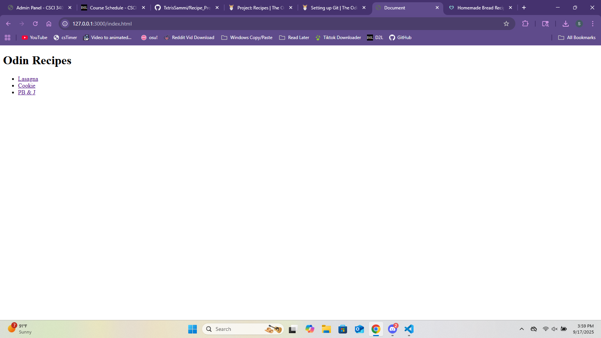
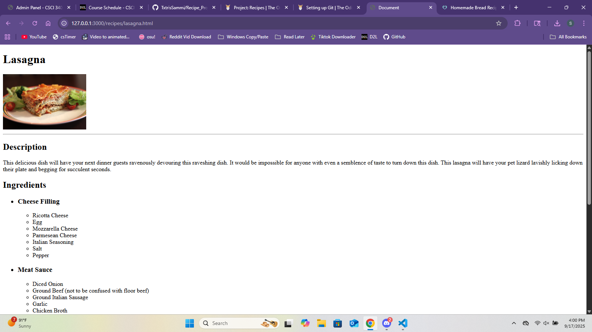
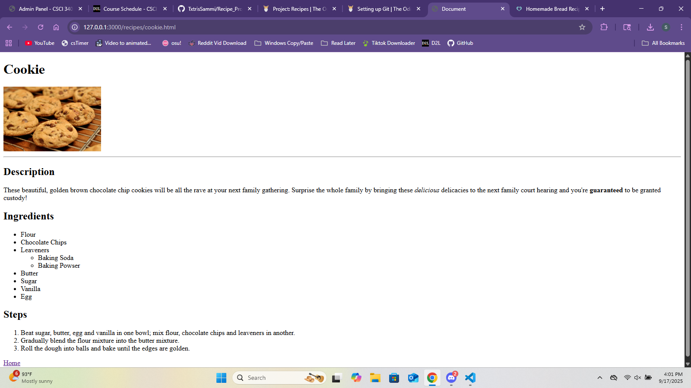

# Odin Recipes Project

## Description

The Odin Recipes project is a webpage designed to display various recipes using proper HTML conventions.

## Project Plan

- Create 3 main recipes
- Include all necessary elements in each recipe
  - Title
  - Image
  - Description
  - Ingredients
  - Steps
- Make at least 1 recipe special in some way
  - To add some character
- Create this README

## Learning Outcomes

- How to use HTML to link between different pages.

- Proper HTML conventions.

- Proper use of Git
  - Git commit convetions
  - Using Git in Terminal
- Proper project structuring
  - Using folder and useful names to manage multiple files

## Future Improvements

- PB & J recipe
  - Create more hyperlinks
  - Create more pages to link to
  - Link to outside resources (i.e. wikipedia)
  - reach ridiculous levels of detail
- Styling
  - Use CSS and/or other resources to make the webpage more appealing to look at
- Home Page
  - Make more visually appealing

  ## Screenshots

- 

- 

- 

## Live Demo

[Link to Demo](https://drive.google.com/file/d/1gogu6qBpB7WrIc96vfd49FkwbMiyp6lh/view?usp=sharing)
